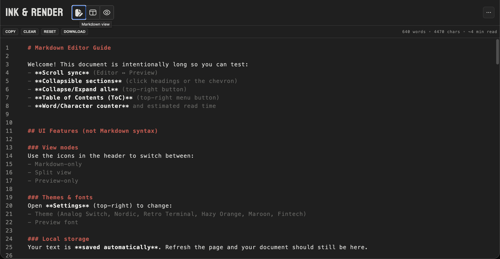
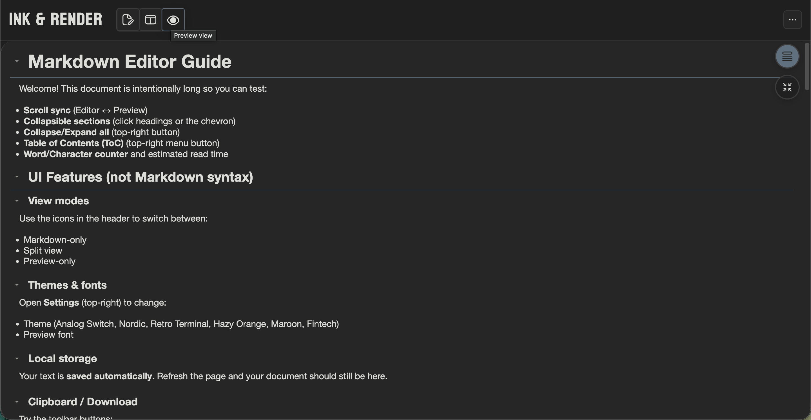
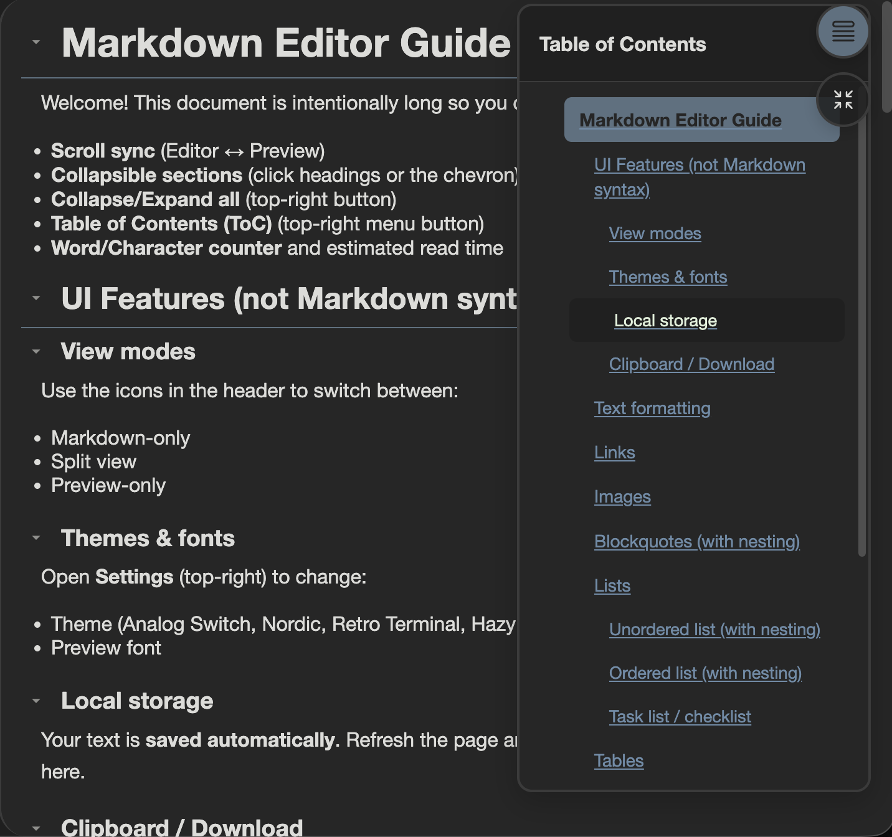
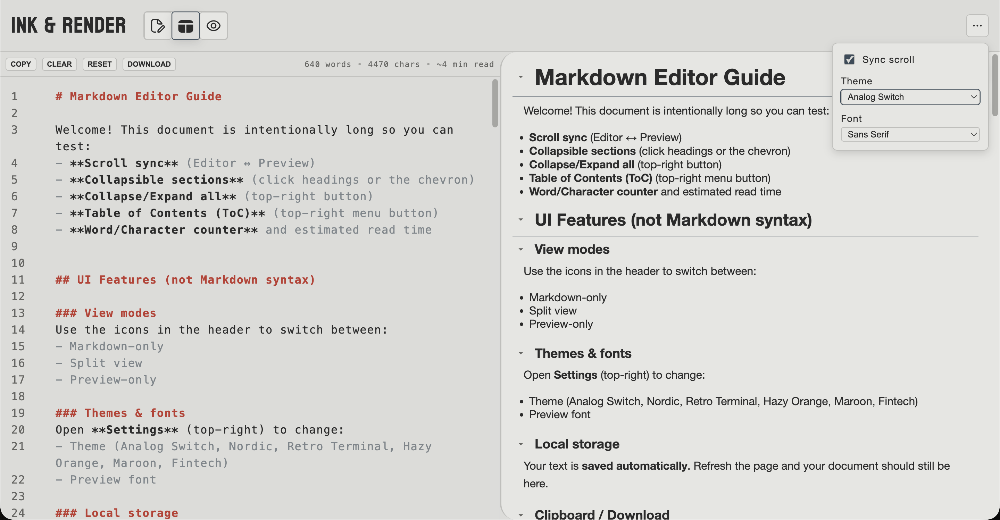
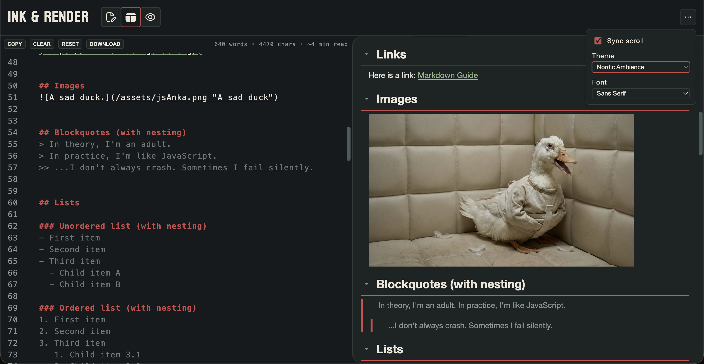
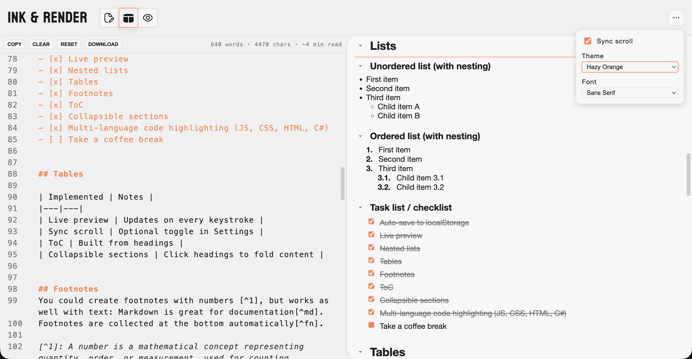
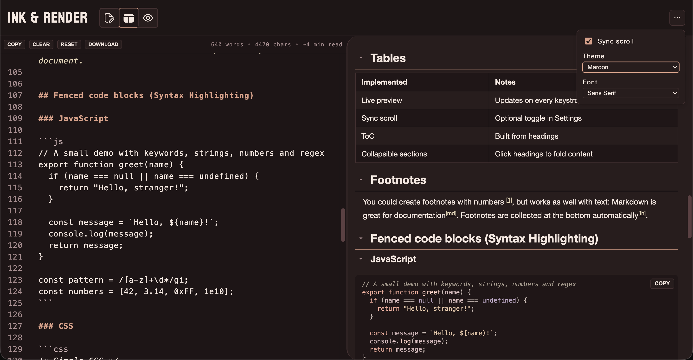
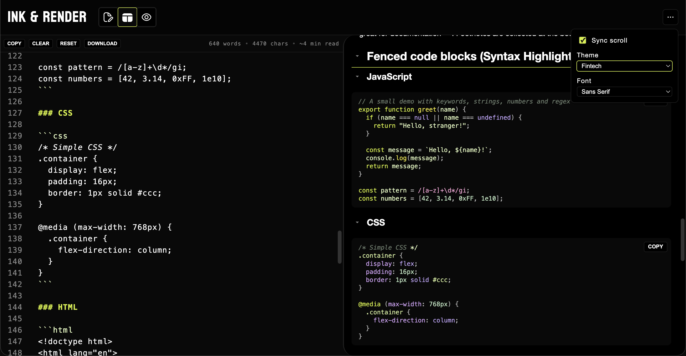

# INK & RENDER - A Markdown Live Preview Editor


Test it live: [Link](https://inkandrender.vercel.app)  

A small, framework-free Markdown editor with a real-time preview, built as a modular vanilla JS project.

## Tech stack

- HTML + CSS (modular CSS with `@import`)
- Vanilla JavaScript (ES modules)
- Custom Markdown parser/renderer (AST-based)
- Node.js (for running the provided test suite)

## Tech Highlights

- **Zero dependencies** in production (fully framework-free)
- **Custom AST-based Markdown parser** built from scratch
- **Modular architecture** with ES6 modules
- **Responsive design** with mobile-friendly UI
- **localStorage persistence** for settings and content

## Features

### Editor + Preview:
- Live preview (updates on every keystroke)
- **Syntax highlighting in editor** for markdown elements (headings, lists, links, bold, italic, etc.)
- **Line numbers** in editor
- Split view / Markdown-only / Preview-only view modes
- Optional **sync scroll** between editor and preview
- Resizable split view (drag handle)

#### Customization:
- **7 color themes** including:
  - Analog Switch (light & dark variants)
  - Nordic Ambience
  - Retro Terminal
  - Hazy Orange
  - Maroon
  - Fintech
- **Font selection** for preview pane (default, monospace, serif, sans-serif)
- **Persistent settings** (theme, font, and sync scroll preferences saved)

#### Navigation:
- **Table of Contents (ToC)** built from headings
  - Smooth scroll navigation
  - Active section highlighting
- **Collapsible sections** in preview (per heading)
- Collapse/expand all sections button

#### Markdown support (highlights/rendering):
- Headings (H1–H6)
- Bold / italic
- Links
- Images
- Blockquotes (including nesting)
- Ordered & unordered lists (including nesting)
- Task lists (checkboxes)
- Horizontal rules (`---`, `***`, `___`)
- Tables
- Footnotes
- Inline code + fenced code blocks

#### Code blocks:
- Syntax highlighting for:
  - JavaScript (` ```js `)
  - CSS (` ```css `)
  - HTML (` ```html `)
  - C# (` ```csharp `)
- Code block "COPY" button in preview

Quality-of-life:
- Auto-save to localStorage
- Live word/character counter + estimated read time
- Toolbar actions: copy markdown, clear, load guide, download `.md`

## Screenshots

<details>
<summary>📷 View all screenshots</summary>

### Editor View


### Preview View


### Table of Contents


### Themes

#### Analog Switch (Light)


#### Analog Switch (Dark)
.png)

#### Nordic Ambience


#### Retro Terminal


#### Hazy Orange


#### Maroon


#### Fintech


</details>

## Getting started

### Install

```bash
npm install
```

### Run locally (browser)

This is a static project. Open `index.html` directly **or** serve the folder with any static server.

Examples (optional):

```bash
# Node (if you have it)
npx serve
```

Then open the shown URL in your browser.

## Project structure (high level)

- `js/main.js` – application entry point
- `js/AST.js` – custom Markdown tokenizer/parser/renderer
- `js/editor/*` – editor modules (highlight, line numbers, sync scroll)
- `js/preview/*` – preview modules (ToC, collapsible sections)
- `js/ui/*` – UI modules (toolbar, settings, view mode, resize)
- `js/utils/*` – utilities (storage, stats, clipboard, markdown guide)
- `css/main.css` – imports modular CSS files

---

The built-in guide (RESET) demonstrates the supported syntax and UI features.
